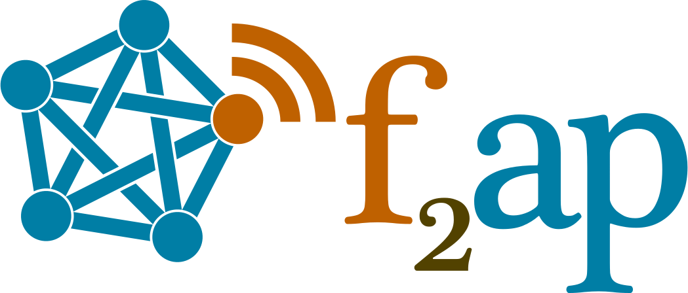

# 

f2ap (_Feed to ActivityPub_) is a web application that uses the RSS/Atom feed of your website to expose it on the Fediverse
through ActivityPub.

## How to use it

### Prerequisite

The only prerequisite to use f2ap is that your website provides an RSS or Atom feed.
If you don't have one yet, you might want to make it first, as it is a Web standard that allows your visitors to stay in touch with your content with any compatible application. Plus, it is very easy to implement. 

You must have either Python 3.9+ or Docker installed and running to run f2ap.

### Installation

### Configuring the proxy server

### Configuration

### Known limitations

